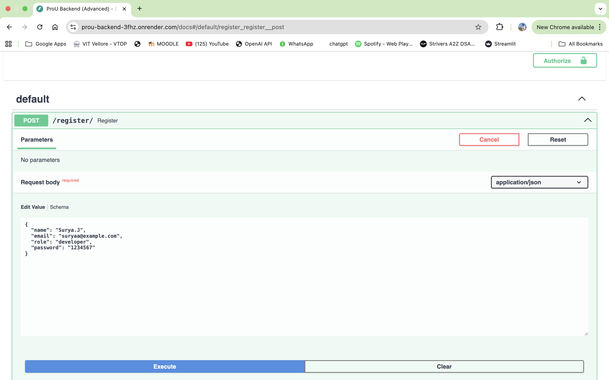
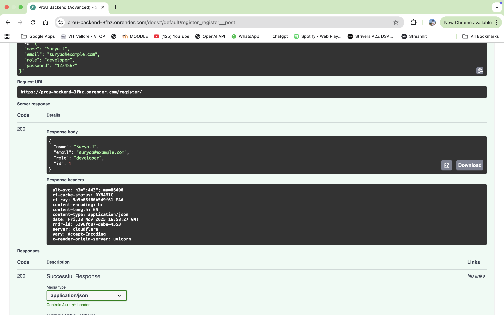
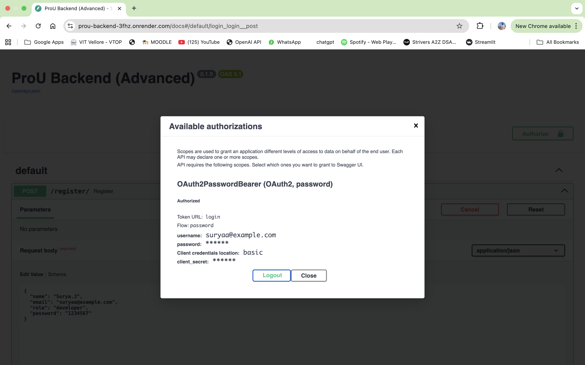
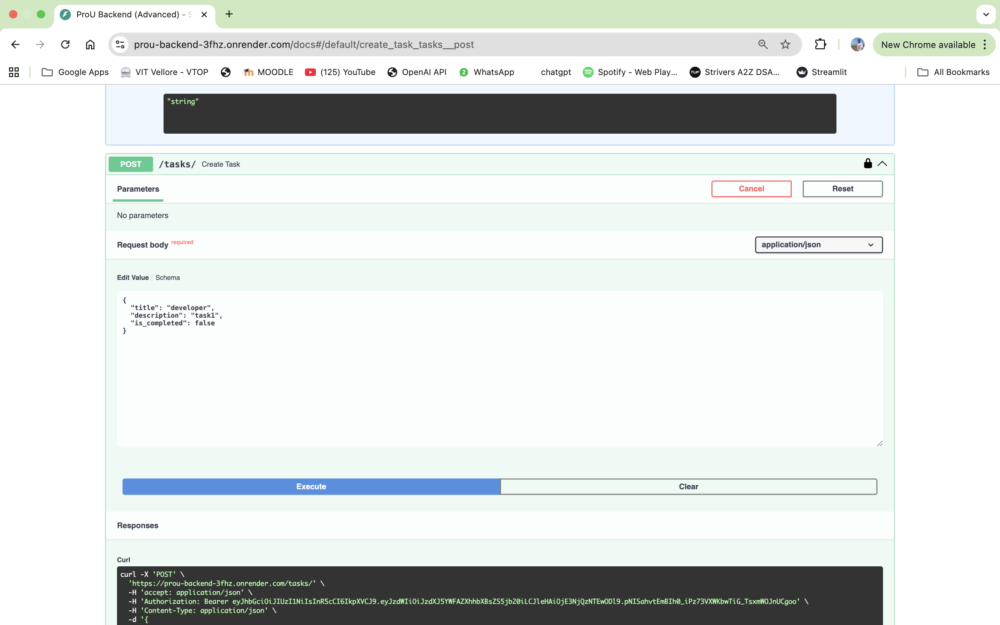
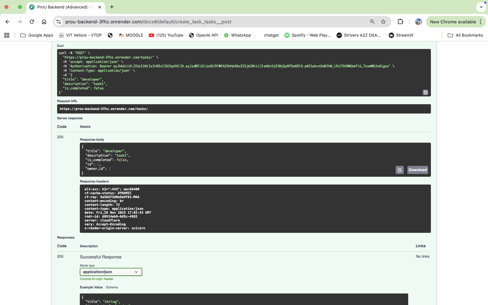

# ProU Backend Assessment 

A high-performance, secure RESTful API for employee & task management. Built with **FastAPI** and **PostgreSQL (Raw SQL)** to demonstrate optimized database control and security best practices.

##  Live Demo
**API Documentation (Swagger UI):** https://prou-backend-3fhz.onrender.com/docs
**Base URL:** https://prou-backend-3fhz.onrender.com


## Key Features
- **Security:** Full **JWT Authentication** flow (Register/Login) with `bcrypt` password hashing.
- **Raw SQL Architecture:** No ORM used. All database interactions use pure SQL queries via `psycopg2` for maximum performance and control.
- **Analytics Engine:** Advanced SQL Aggregation endpoint to calculate real-time task completion rates per employee.
- **Background Tasks:** Asynchronous email simulation upon user registration to improve API response time.
- **Automated Schema:** System automatically detects and creates necessary database tables on startup.

## Tech Stack
- **Framework:** FastAPI (Python 3.10+)
- **Database:** PostgreSQL
- **Driver:** `psycopg2-binary` (Raw SQL)
- **Validation:** Pydantic
- **Security:** OAuth2, Passlib (Bcrypt), Python-Jose (JWT)
- **Deployment:** Render Cloud

## Setup Instructions (Local Dev)

1. **Clone the repository**
   ```bash
   git clone [https://github.com/YOUR_USERNAME/prou-backend-final.git](https://github.com/YOUR_USERNAME/prou-backend-final.git)
   cd prou-backend-final

  Project Implementation Snapshots:
  
  
  
  
  
  

